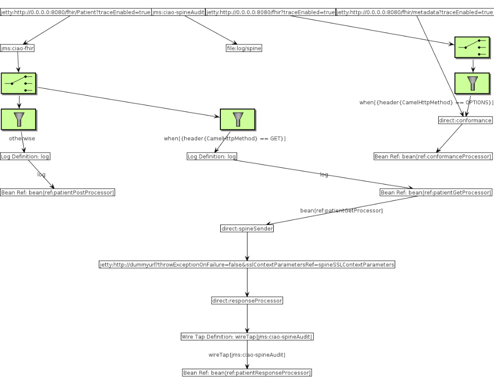

Overview
========

This is the first proof of concept CIP for the CIAO project.

The objective of the CIP is to provide a minimal implementation of a ReST-based FHIR server, supporting just one FHIR resource (Patient), which acts as a facade in front of the national Personal Demographics Service (PDS). This would effectively allow a client to query PDS using a simple FHIR request.

The scope of this trial CIP is limited to a PDS simple trace interaction, so it will not support all aspects of the FHIR standard, nor will it provide all functionality available in PDS (in fact is is a subset of the functionality outlined in the PDS mini services specification).

Building and Running
--------------------

To pull down the code, run:

	git clone https://github.com/nhs-ciao/ciao-pds-fhir.git
	
You can then compile and generate a JAR file:

	mvn package

This will generate two jar files, one which is just the CIP code, and which could be deployed into an OSGi container, and a second (with an -executable suffix) which includes all dependencies and can be run as a standalone jar - for example:

	java -jar target/ciao-pds-fhir-0.0.1-SNAPSHOT-executable.jar

In order for the CIP to work, currently you will need to have a copy of the Spine TKW simulator running on the local machine. You can get this running using an install script available in the ciao-utils repository:

	wget https://raw.githubusercontent.com/nhs-ciao/ciao-utils/master/contrib/tkw/getTKW.sh
	chmod +x getTKW.sh
	sudo ./getTKW.sh Spine /opt/SpineTKW CIAOTest
	java -jar /opt/SpineTKW/TKW.jar -simulator /opt/SpineTKW/config/SPINE_MTH_20111121/tkw.properties

Scope / Progress
----------------

NOTE: This is a limited proof-of-concept CIP. As part of the ongoing development of CIAO, it may be desiable to develop a full PDS FHIR CIP. The discussion around the design of such a CIP will be held in the [CIAO design repository](https://github.com/nhs-ciao/ciao-design)

Specific functionality for this proof-of-concept CIP:

* Accept GET requests for a patient resource with basic FHIR query parameters (e.g. http://localhost:8080/fhir/Patient?family=SMITH) **complete**
* Parse the request and build a Spine simple trace message **complete**
* Send the request to a running instance of the Spine TKW simulator **complete**
* Send the request to a Spine test region over a TLS MA link **complete**
* Parse the response **complete**
* Populate a FHIR patient resource and return it to the requestor **complete**
* Use FHIR bundle for returning results **in progress**
* FHIR conformance reporting **complete**
* JSON Support **complete**
* Error handling (HTTP Error) **in progress**
* Error handling (SOAP Fault) **in progress**
* Error handling (HL7 QueryActFailed) **in progress**
* Error handling (FHIR OperationOutcome) **not started**
* Add Unit Tests **not started**
* Add JMX hooks **not started**
* Configuration management using the [ciao-configuration](https://github.com/nhs-ciao/ciao-utils/tree/master/ciao-configuration) project **complete**
* Test in an OSGi container (Service Mix) **not started**

Potential additional enhancements:

* Migrate to FHIR DSTU2 (currently DSTU1) **not started**

Requirement Traceability
------------------------

Some requirements from published specifications have been used to ensure this CIP roughly aligns with current guidance. Where possible, these are referenced directly as comments in the code. The below naming convention has been used to identify requirements:

**REQ-SRC-NNN**

**SRC** = Source - one of:

* PDSMS = ITK Spine Mini Services - PDS Provider Requirements (part of the "ITK Spine Mini Service" bundle on TRUD).

**NNN** = Requirement Number. Where a source does not number its requirements in this way, a document section number will be used instead.

So, a comment mentioning REQ-PDSMS-4.5.2 would refer to the requirement(s) outlined in section 4.5.2 of the ITK Spine Mini Services - PDS Provider Requirements document.

CIP Diagram
-----------

The below diagram shows the routes in this CIP (generated using the diagram generator from [rmannibucau](https://github.com/rmannibucau/diagram-generator-parent)):

